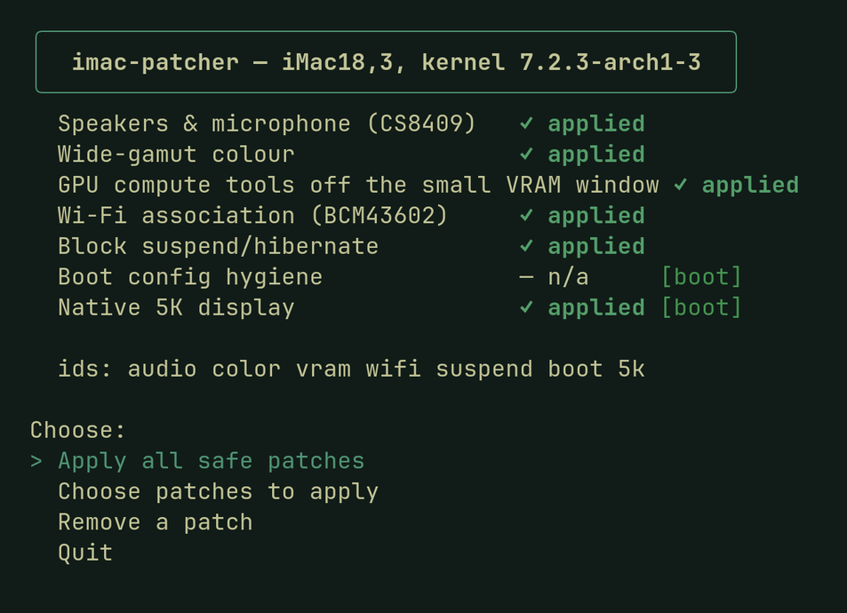
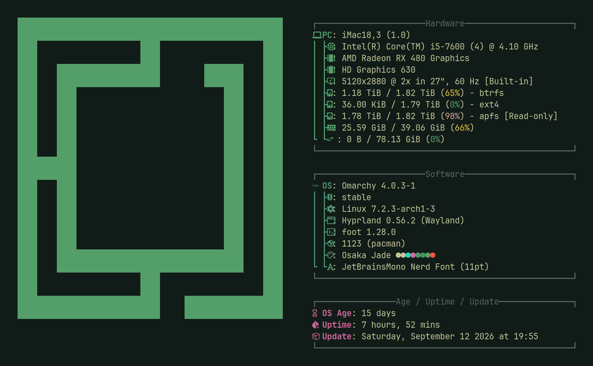

<div align="center">

# 🖥️ Omarchy on iMac 5K (18,3)

**Omarchy on the 2017 27″ 5K iMac (iMac18,3) — running the way it should.**


[](https://omarchy.org)


</div>

Native **5120×2880**, real **speakers and mic**, true **wide-gamut colour**, the **hidden Intel GPU** on video duty and a **brightness slider that works** — the hardware Apple leaves half-asleep for everyone but macOS, woken up. **One command. Every change reversible. Nothing touched without asking.**

[Omarchy](https://omarchy.org)'s whole promise is *“we can fix everything.”* This points that at a 2017 iMac.

```bash
bash <(curl -fsSL https://raw.githubusercontent.com/ahmadtv/omarchy-imac18-3/main/install)
```

> For the **2017 27-inch iMac (iMac18,3)**. Built and tested on Omarchy (Arch + Hyprland); the audio and colour pieces are largely distro-agnostic.

---

## ✨ What this patch makes work

| | |
|---|---|
| 🖥️ **Native 5K** | Full **5120×2880**. The panel is two 2560×2880 tiles Apple leaves dormant; this wakes the second one, stitches both into one display, and genlocks them so they scan in lockstep — seamless under motion. |
| 🔊 **Speakers & mic** | The CS8409 codec the kernel can't drive at all — now with working speakers and both the internal **and** headset mic, with **automatic switching** on plug/unplug just like macOS. |
| 🎧 **Apple EarPods** | Fully supported. Plug them in and audio + mic follow the jack; unplug and it's back to internal — automatically. All three **inline buttons** work too: play/pause, volume up, volume down. |
| 🎨 **True colour** | The wide-gamut **Display P3** panel mapped correctly, instead of the oversaturated mess of stock sRGB. |
| 🎬 **Hardware video encode** | Screen recording and H.264 export on the Radeon's own encoder, without the GPU hang every Polaris card has had since kernel 7.1.6 (AMD's upstream fix, backported until the distro kernel carries it). And if the GPU ever does hang, it now resets and you are back at a fresh desktop in about five seconds instead of a frozen machine. The two reset fixes are reported to AMD with patches: [drm/amd#5810](https://gitlab.freedesktop.org/drm/amd/-/issues/5810). |
| 🧠 **Intel Quick Sync (the hidden iGPU)** | Apple firmware hides the iMac's Intel HD 630 from anything that isn't macOS. The kernel already tells Apple firmware it's booting macOS on some MacBook Pros; this adds the iMac18,3 to that list — so the Intel chip appears and, like on macOS, takes over video: every app that uses the first GPU (ffmpeg, GStreamer, Strata previews, Kdenlive exports) encodes and decodes on Quick Sync, H.264 about **3.7× faster** than the Radeon, plus HEVC 10-bit and VP9. The Radeon keeps the display, the desktop and all 3D. Reported to Intel: [drm/i915#17042](https://gitlab.freedesktop.org/drm/i915/kernel/-/issues/17042). *(module `macos`)* |
| 🔆 **Brightness** | The brightness slider works — over the panel's **full 500-nit range** (Apple's ACPI table stops Linux at 80%, the same gap Boot Camp users see) — and the panel comes up at your saved brightness from power-on, like macOS. *(module `macos`)* |

## 🖥️ On the machine

The patcher on a fully set-up iMac18,3 — everything applied:



…and what that gets you — `fastfetch` on the running 5K desktop:



## ✅ Already fine out of the box

No patch needed — these just work on Omarchy / Linux:

🌐 Ethernet · 📶 Wi-Fi (Omarchy applies the Broadcom handshake fix for Macs itself) · 🔷 Bluetooth · 📷 Webcam · ⌨️ Keyboard & trackpad · 🔌 USB · ⚡ Thunderbolt / 10GbE

Thunderbolt is on the in-tree `atlantic`/`thunderbolt` drivers — tested with an **OWC Thunderbolt 3 10GbE** adapter. Like on any Linux box, a Thunderbolt device needs a one-time authorization the first time you plug it in (`boltctl enroll`, or your desktop's prompt); after that it's remembered. Nothing this patch does — just how Thunderbolt security works.

## 🚫 Not working (yet)

Straight about the gaps:

- 💳 **SD / memory-card reader** — not working yet. The card is recognised, then every read fails at the data phase; **still being worked on** — cross-checking against macOS on the same machine to tell a driver quirk from a genuine hardware fault.
- 🔆 **Auto-brightness** — the ambient-light sensor works, but isn't wired to the (now working) backlight yet.
- 😴 **Suspend / sleep** — hard-hangs the machine every time (Apple firmware; only a power-cycle recovers). The `suspend` module masks it so nothing triggers it by accident.

---

## 🧩 Install

The one-liner above clones the patcher and opens its menu. Or do it by hand:

```bash
git clone https://github.com/ahmadtv/omarchy-imac18-3
cd omarchy-imac18-3 && ./scripts/imac-patcher
```

The patcher shows what's applied, what isn't, and lets you pick — **nothing is applied without asking**. Omakase in spirit: sensible defaults, and you can send any of it back. Each piece is a separate, reversible step:

```bash
./scripts/imac-patcher --apply 5k      # native 5K (rebuilds only the amdgpu module)
./scripts/imac-patcher --apply audio   # speakers, mics, EarPods + buttons
./scripts/imac-patcher --apply vram    # ggml/Vulkan tools off the 256 MiB CPU-visible window
./scripts/imac-patcher --apply macos   # Intel iGPU for video + working, full-range brightness (kernel tells the firmware it's macOS)
./scripts/imac-patcher --remove 5k     # full undo, any time
```

**The 5K module needs kernel 7.1.x or 7.2.x** and the patcher refuses anything else — a mis-applied GPU patch means a broken display, so a newer kernel must be re-ported by hand first. You supply nothing else: the installer fetches the matching kernel source itself (≈8 GB, ~20–40 min the first build; re-runs are fast).

### 🔄 Updating Omarchy — patch before you reboot

A kernel update replaces the GPU driver the 5K patch lives in. So:

1. **Update Omarchy** as usual. If it offers to reboot, not yet.
2. **Run the one-liner again.** It pulls the latest patcher and shows what the new kernel is missing — usually just `5k`. Apply it.
3. **Reboot.**

Audio (DKMS) and macOS mode follow the new kernel on their own; the patcher only checks them. Rebooted too early? Run the one-liner anyway — you just spend one boot without 5K. If the new kernel is too new for the 5K patch, the patcher says so, and **Snapshots** in the boot menu boots the system as it was before the update.

> **Not on Omarchy?** Mark Pronkin maintains a universal fork — [`imac5k-universal-linux-patcher`](https://github.com/MarkPronkin/imac5k-universal-linux-patcher) — with one-command install/update, automatic dependency install, and preliminary Fedora support (more distros in progress).

---

## 🎛️ Local AI tools and the reboot freeze

The Radeon exposes only a **256 MiB CPU-visible slice** of its memory. Vulkan tools built on ggml — [voxtype](https://github.com/nicobrenner/voxtype) and most local speech/LLM apps — can fill it, and then the machine **freezes at the Omarchy logo on reboot**. The `vram` module (on by default) tells ggml to stay out of that slice, for every such tool.

## 🛟 Safety

Every patch backs up what it replaces and can be reversed. Boot-related changes print their recovery steps first. A new `amdgpu` build never has to replace the working one to be tried — `scripts/imac-alt-entry` boots it from its own hash-pinned Limine entry with the default untouched. See [`patches/README.md`](patches/README.md).

## 🔬 Under the hood

- **Native 5K, the three layers (wake · stitch · genlock)** and the install rules → [`patches/README.md`](patches/README.md)
- **The hidden Intel GPU, the brightness fixes and the macOS-mode boot** → [`igpu/README.md`](igpu/README.md)
- **Open items, root causes and rejected approaches** → [`TODO.md`](TODO.md)
- **Upstream issues and PRs** → [Upstream](#-upstream) below

## 📮 Upstream

Everything here that belongs in the kernel, the audio driver or Omarchy itself, and where it stands. Once a fix lands upstream, the matching patch leaves this repo. _Last checked 2026-09-12._

| Where | What | Status |
|---|---|---|
| [drm/amd#4455](https://gitlab.freedesktop.org/drm/amd/-/issues/4455) | Native 5K on iMacs (community thread): this project's genlock fix, the first verified iMac18,3, and a lean mainline candidate (kernel exposes two tiles, compositor stitches) | Open, under discussion; VCE fix and set_os findings shared 2026-09-12 |
| [drm/amd#5810](https://gitlab.freedesktop.org/drm/amd/-/issues/5810) | GPU reset after a VCE hang: two fixes (reset deadlock in `dm_suspend`, VCE suspend during reset), patches inline | Open, filed by us, waiting for AMD |
| [drm/amd#5595](https://gitlab.freedesktop.org/drm/amd/-/issues/5595) | The VCE encoder hang itself (Polaris, since 7.1.6) | Fixed upstream (`2ee9836545e6`, 7.3); backported here until Arch's kernel has it |
| [drm/i915#17042](https://gitlab.freedesktop.org/drm/i915/kernel/-/issues/17042) | Hidden Intel HD 630 running headless: a quirk so i915 creates no outputs on iMacs, then the kernel's set_os list gains `iMac18,3` | Open, filed by us, no reply yet |
| linux-efi (mailing list) | One line: add `iMac18,3` to `apple_match_product_name()` in `x86-stub.c` (the patcher applies the same change at build time) | Not sent; waits on #17042 |
| [jackdanyell/imac18-3-cs8409-linux-audio#5](https://github.com/jackdanyell/imac18-3-cs8409-linux-audio/pull/5) | Headset mic, live jack switching, mic gains, EarPods remote buttons | Open PR |
| [omacom/omarchy#10985](https://github.com/omacom/omarchy/pull/10985) | Omarchy's audio panel lists each jack's ports as rows, the way macOS and GNOME do | Open PR |
| [omacom/omarchy#11464](https://github.com/omacom/omarchy/pull/11464) | Omarchy's Mac support page gains the 2017 iMac 5K: its known issues on stock Omarchy, and a link here | Open PR |
| [lgse/strata#127](https://github.com/lgse/strata/issues/127) | GPU hang while Strata generated a video preview | Closed; the cause was the kernel VCE bug (#5595) |

## 🤝 Contributing

On an **iMac18,3** and hit a bug, or made part of this better? [Open an issue or PR](../../issues) — I'll pull in what's solid.

## 🙏 Credits

Native 5K builds on community work from [drm/amd#4455](https://gitlab.freedesktop.org/drm/amd/-/issues/4455) — mforce2 (tile wake), erik2 (stitch), taprobane99 (7.2.x port), with guidance from AMD's Alex Deucher. The genlock fix and the first verified iMac18,3 result came from this project. Audio driver by [jackdanyell](https://github.com/jackdanyell/imac18-3-cs8409-linux-audio). Multi-distro fork by [Mark Pronkin](https://github.com/MarkPronkin/imac5k-universal-linux-patcher).

---

_Omarchy’s promise is “we can fix everything.” This is one more thing, fixed._
