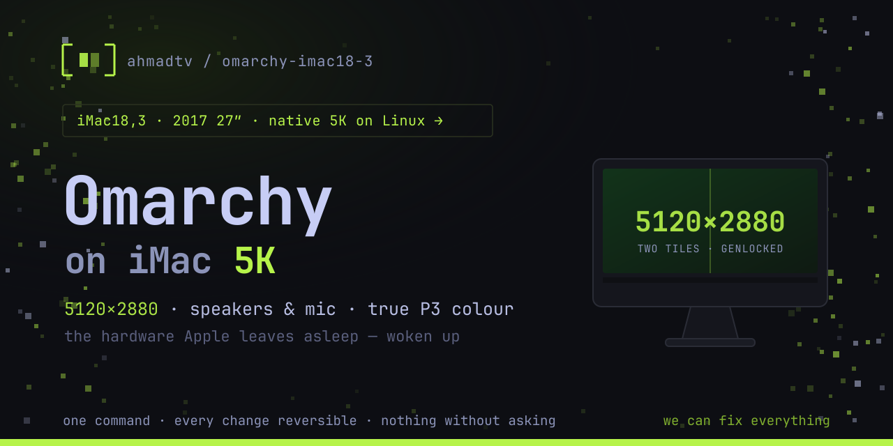

# 🖥️ iMac18,3 Patch



**Makes a 2017 27" 5K iMac work properly under Linux — native 5120×2880, working speakers, and correct colour.**

Apple's 2017 iMac hardware has several things stock Linux gets wrong or doesn't support at all. This repo is a patcher that fixes them, one command at a time, with every change reversible.

```bash
git clone https://github.com/ahmadtv/omarchy-imac18-3-patch
cd omarchy-imac18-3-patch
./scripts/imac-patcher
```

The patcher shows you what's applied, what isn't, and lets you pick. Nothing is applied without asking.

---

## 🔧 What it fixes

| | Problem on stock Linux | Status |
|---|---|---|
| 🖥️ **Display** | Panel is two 2560×2880 tiles; stock `amdgpu` drives one and stretches it. No native 5K. | ✅ Native 5120×2880, genlocked |
| 🔊 **Speakers / mic** | CS8409 codec: kernel finds no speaker output at all. Silent machine. | ✅ Hardware-gated DKMS driver |
| 🎚️ **Speaker tone** | Codec does zero DSP; macOS's warmth is all software EQ that Linux lacks. | ✅ PipeWire EQ profile |
| 🎨 **Colour** | Wide-gamut (P3) panel rendered as sRGB — everything oversaturated. | ✅ Correct gamut mapping |
| 😴 **Suspend** | Hard-hangs the machine every time (Apple firmware ACPI issue). | ⚠️ Masked off — see below |
| ⚡ **Thunderbolt / 10GbE** | Adapter detected but never authorised. | ✅ Persistent enrolment |

---

## 🖥️ The headline: native 5K

The internal panel is a genuine dual-tile display — two 2560×2880 halves on separate physical links, which Apple's firmware leaves half-asleep for non-Apple operating systems. Stock `amdgpu` only ever lights one tile and lets the panel stretch it.

The patch stack fixes this in three layers, all inside the `amdgpu` module:

1. ⚡ **Wake** — a vendor DPCD write (`0x4F1`) powers up the dormant second link
2. 🧵 **Stitch** — both tiles are presented to userspace as one 5120×2880 output, so compositors work unmodified
3. 🔒 **Genlock** — per-frame CRTC sync so the two halves scan in lockstep (mainline has this as a literal `TODO`; filling it is this project's own contribution, submitted upstream)

Install it without a second kernel — only the `amdgpu` module is rebuilt for your running kernel, with the stock module backed up:

```bash
./scripts/imac-patcher            # menu-driven
./scripts/imac-patcher --apply 5k  # or direct
./scripts/imac-patcher --remove 5k # full undo, any time
```

**Read [`patches/README.md`](patches/README.md) first.** The patch is verified against kernel **7.1.x and 7.2.x only** and the installer refuses anything else, because a mis-applied patch means a broken GPU module.

You don't need to supply any files — the patch ships in this repo, and the installer downloads the matching kernel source from kernel.org itself. What you do need:

- 🛠️ **Build tools and kernel headers** — `base-devel bc pahole linux-headers`. The patcher checks for these up front and offers to install anything missing, rather than failing part-way through a compile.
- 💾 **About 8 GB of disk** for the kernel source tree.
- ⏱️ **20–40 minutes** for the first build. Re-runs (e.g. after a kernel update) reuse the tree and are much faster.

Re-run it after any kernel update — the patched module is built for one specific kernel version and a new kernel reverts you to stock (which the patcher will report as `partial`).

---

## 🔊 Audio

The CS8409 codec needs an out-of-tree driver — the in-kernel one doesn't recognise a speaker output on this board at all:

```bash
git clone https://github.com/jackdanyell/imac18-3-cs8409-linux-audio
cd imac18-3-cs8409-linux-audio && sudo ./install-imac18-3.sh && sudo reboot
```

Then, optionally, the tone fix. The codec and amplifier do no processing whatsoever — macOS's fuller sound is entirely software EQ, which Linux has no equivalent of. [`configs/eq6.conf`](configs/eq6.conf) is a PipeWire filter-chain (bass shelf, corrective bands, and a clipping clamp) → copy to `~/.config/pipewire/filter-chain.conf.d/`.

---

## 🎨 Colour

The panel is wide-gamut Display P3. Hyprland's default `srgb` mode doesn't gamut-map for it, so everything looks oversaturated. In `~/.config/hypr/monitors.lua`:

```lua
hl.monitor({ output = "", mode = "preferred", position = "auto", scale = 2, cm = "dp3" })
```

---

## 😴 Suspend — read this before you try it

Suspend and hibernate **hard-hang this machine, every time**. This is an Apple firmware ACPI issue, not something a kernel parameter fixes; sleep mode, the display override, and GPU power states were each ruled out by testing. Recovery is a hard power-cycle.

The patcher masks the sleep targets so nothing triggers them by accident:

```bash
sudo systemctl mask suspend.target hibernate.target hybrid-sleep.target suspend-then-hibernate.target
```

---

## 🚧 Known rough edges

- 🌗 **Skewed Apple logo on *warm* reboots** with 5K active — root-caused: the display was never turned off at reboot, so Apple's firmware inherited a live dual-tile panel. **Fixed and shipped** (`patches/5k-latch-clear.patch`): the display is shut down properly at reboot, every register the stitch wrote into the second tile is undone, and the panel is powered off before the handoff. Confirmed on hardware with a captured teardown. A follow-up (`patches/5k-latch-clear-going-down-only.patch`) limits that teardown to the reboot path — as first shipped it also ran on every ordinary stream-off and caused repeated black flashes on the second tile (see below). What remains: the warm-reboot logo is straight but slightly soft, because the firmware draws it on one tile after the handoff; a cold boot is crisp. Cosmetic.
- 🪞 **Sheared seam after login** — two causes, both **fixed and shipped**: the driver's master pick left the slave tile out of the hardware sync group (`patches/5k-genlock-deterministic.patch`), and on a full modeset the one-shot alignment ran before the re-trained tile was up (`patches/5k-genlock-settle-resync.patch`, a re-sync 250 ms after each tiled commit). The black flashes on the second tile after the disk password, and the brief skew as the session exits before a reboot, were a regression from the first logo fix (its latch clear ran on every stream-off and each write toggled the tile's hotplug line, forcing a full re-detect and re-train on the next commit — 30–40 re-detects per boot instead of 4). Fixed and shipped: `patches/5k-latch-clear-going-down-only.patch`.
- 🎬 **Video encode (VCE)** hangs the GPU on certain transcodes, taking the session down. Under investigation.
- 📺 **YouTube 4K is CPU-decoded** — Polaris has no VP9/AV1 silicon. Hardware limit, not fixable.

---

## 📋 Requirements

- Apple iMac18,3 (2017 27" 5K). The patcher refuses to run on other hardware.
- Kernel 7.1.x or 7.2.x for the 5K patch (everything else is version-independent)
- Omarchy is what this is developed and tested against. The audio, EQ and colour pieces are largely distribution-agnostic; the boot-related pieces assume Limine.

## 🛟 Safety

Every patch backs up what it replaces and can be reversed. Boot-related changes print their recovery steps *before* running. A new `amdgpu` build never has to replace the working one to be tried: `scripts/imac-alt-entry add <name> <module>` boots it from its own hash-pinned Limine entry with the default untouched (see [`patches/README.md`](patches/README.md)). If a boot change ever goes wrong: boot the Limine snapshot entry, restore `/etc/default/limine.backup`, re-run `limine-mkinitcpio`, reboot.

## 🧭 How this was worked out

Open items, root causes and rejected approaches are tracked in [`TODO.md`](TODO.md).

## 🙏 Credits

Native 5K builds on community work from [drm/amd#4455](https://gitlab.freedesktop.org/drm/amd/-/issues/4455) — mforce2 (tile wake), erik2 (stitch), taprobane99 (7.2.2 port), with guidance from AMD's Alex Deucher. The genlock fix and the first verified iMac18,3 result came from this project. Audio driver by [jackdanyell](https://github.com/jackdanyell/imac18-3-cs8409-linux-audio).
